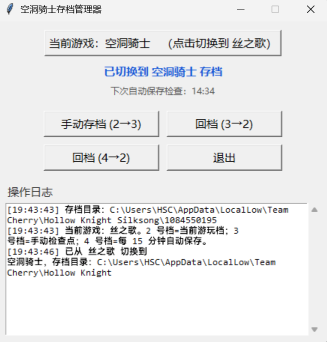

# 空洞骑士 / 丝之歌 存档管理器（Hollow Knight Save Manager）

> ### 为您的 钢魂模式 & 速通成就 保驾护航
>
> 一款给《Hollow Knight》和《Hollow Knight: Silksong》用的轻量存档管理工具（Windows / macOS 双平台）。
> 避免频繁地手动**回档**。
>
> 开游戏时一起打开它，用几个按钮即可：把当前档存成检查点、回档、以及每 15 分钟自动备份，避免手滑丢进度。
> 窗口顶部按钮可在两款游戏之间随意切换，各自存档目录独立记忆。

## 下载

- **Windows**：[HollowKnightSaveManager.exe](https://github.com/Shuaichen-He/hollow-knight-save-manager/releases/download/v2.0/HollowKnightSaveManager.exe)
  —— 单文件，双击即运行，**无需安装、无需本机有 Python**。
- **macOS**：[hollow-knight-save-manager.pkg](https://github.com/Shuaichen-He/hollow-knight-save-manager/releases/download/v2.0/hollow-knight-save-manager.pkg)
  —— 双击安装到用户级 `~/Applications`（也可直接把 `.app` 拖进去，免安装器）。

> 两个二进制都放在仓库的 **GitHub Release（v2.0）** 中；私有仓库需先登录 GitHub 再下载。
> 仓库于 2026-08 由 `silksong-save-manager` 更名而来，旧链接会自动跳转到新地址。

## 不同电脑的存档路径会自动适配（下载后无需改配置）

本工具的 exe / pkg **不会写死任何人的存档路径**，下载到任意一台电脑都能自动找到该机器的存档目录，**无需你手动编辑任何配置文件**：

- **用户名不同**：Windows 版探测 `C:\Users\<当前用户>\AppData\LocalLow\Team Cherry\...`（用的是「当前用户主目录」，而不是固定的 `HSC`）；macOS 版探测 `~/Library/Application Support\...`（用当前用户 home）。换台机器、换个人都自动正确。
- **Steam 账号 / steamid 不同**：丝之歌的存档在 `Hollow Knight Silksong\<steamid>\` 下，程序会**自动扫描**该目录、找到含 `Restore_Points2` 的那个数字文件夹，无需你手动填写 steamid。

### 极少数情况需要你点一下：自动探测失败时

如果程序**没能自动找到**存档目录（常见于：你还没启动过对应游戏、或存档位置异常），它会弹出一个选择框让你手动指定——**只需选一次，之后会记住，不再询问**：

- **丝之歌**：选中 `Hollow Knight Silksong\<你的 steamid>\` 下面那个**包含 `Restore_Points2` 的数字文件夹**。
- **空洞骑士**：选中**包含 `user2.dat` 的文件夹**（即 `Hollow Knight` 本身）。

### 选错了 / 想重新探测？

本工具把「各游戏存档目录」记在一个配置文件里：

- **Windows**：exe 同目录的 `hollow_knight_save_manager.json`（若 exe 放在只读位置如 `Program Files`，则在 `%APPDATA%\HollowKnightSaveManager\hollow_knight_save_manager.json`）
- **macOS**：app 包内 `Contents/Resources/hollow_knight_save_manager.json`

删除该文件（或其中对应游戏的条目）后重新打开程序，即会重新自动探测。

## 预览

## 功能

- **切换游戏**：窗口顶部居中按钮，在「丝之歌」与「空洞骑士」之间随意切换；两款游戏独立记忆存档目录，并记住上次选择。
- 1 号档不做修改，默认是玩家一周目的主要存档。
- **手动存档 (2→3)**：把 2 号档完整复制到 3 号档。3 号档作为可复用检查点，**保留不变**，可反复回档到它。
- **回档 (3→2)**：把 3 号档复制回 2 号档（3 号档保留），下次进游戏点 2 号档即为回档后的状态。
- **回档 (4→2)**：把 4 号档（每 15 分钟自动保存的检查点）复制回 2 号档。
- **自动保存**：后台每 15 分钟检测 2 号档是否变化，有变化则复制到 4 号档；无变化就跳过，直到你退出。
- 后台仅一个轻量线程 + 1 秒倒计时刷新，CPU/内存占用极小。

> [!WARNING]
> 温馨提示：当卡在某一 Boss 的时候，可以使用 2 和 3 档来回替换的方式避免重复开启游戏。
> 例如：2 档碎了 → 3 回档到 2 → 玩 3；3 碎了之后 → 2 存档到 3 → 玩 2，如此来回反复。
> 游戏中回档当下看不见档的情况（即回档之后依然显示碎档），但碎档后从开始界面重新进入会再次加载，回档的进度就被重新加载了，因此不用担心。

## 各版本注意事项

### Windows

- `HollowKnightSaveManager.exe` 是**便携单文件**，下载后双击即可运行，**不需要安装步骤、也不需要本机有 Python**。
- **不同电脑的存档路径自动适配**：运行时自动探测 `C:\Users\<当前用户>\AppData\LocalLow\Team Cherry\...`，用户名和 steamid 不同都不影响（详见上方「不同电脑的存档路径会自动适配」一节）。
- 配置 / 日志写在 **exe 同目录**（便携、不污染用户目录）；若该位置不可写（如装到 `Program Files`），自动回退到 `%APPDATA%\HollowKnightSaveManager\`。
- 未签名，首次运行若被 Windows SmartScreen 拦截，点「更多信息 → 仍要运行」即可，不影响功能。

### macOS

- `hollow-knight-save-manager.pkg` 安装到**用户级** `~/Applications/HollowKnightSaveManager.app`（不需要管理员密码）；
  最省事的办法是把 `.app` 直接拖进 `~/Applications`，连安装器都不需要。
- 存档目录自动探测 `~/Library/Application Support/...`：
  - 丝之歌：`unity.Team-Cherry.Silksong/`（含 `Restore_Points2` 的数字目录）
  - 空洞骑士：`unity.Team Cherry.Hollow Knight/`（平铺的 `user1~4.dat`）
  - 探测不到会弹窗手动选择，选择写入 app 包内 `Resources/hollow_knight_save_manager.json` 记住。
- 未签名，首次运行若被拦截（「无法验证开发者」）：右键 → 打开，或用终端
  `sudo installer -pkg hollow-knight-save-manager.pkg -target /`。

## 目录结构

| 路径 | 内容 |
| --- | --- |
| `mac/` | macOS 版：源码 `save_manager.py`、打包脚本 `build_app.sh` / `build_pkg.sh`、图标 `silksong.icns` |
| `windows/` | Windows 版：源码 `save_manager_win.py`、构建脚本 `build_exe.bat`、图标 `icon.ico` |

> 构建出的二进制（macOS `.pkg`、Windows `dist/*.exe`）体积大，**不进 git**（已 gitignore），统一放在 GitHub Release 供下载。

> 想从源码自己构建：mac 用 `mac/build_app.sh` + `mac/build_pkg.sh`（需本机 Python + tkinter）；windows 用 `windows/build_exe.bat`（目录已附带预编译好的 `windows/dist/HollowKnightSaveManager.exe`，无需自行构建）。

## 使用方法（两平台通用）

1. 开游戏的同时打开本工具；默认打开上次使用的游戏，点顶部按钮可切换到另一款。
2. 进游戏点 **2 号档** 开始游玩。
3. 想存检查点：切出游戏 → 点 **手动存档 (2→3)**。
4. 想回档：点 **回档 (3→2)** 或 **回档 (4→2)**（都有确认框），回档后下次进游戏点 2 号档即可。
5. 4 号档需先触发过一次 15 分钟自动保存（或点过 3→2 之前已有自动保存）才有内容可回。
